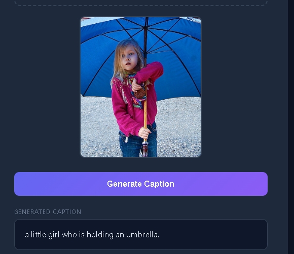

#  Image Captioning — CNN + Transformer

> ResNet-50 encoder + Transformer decoder trained on MS COCO dataset.
> Converted from a Jupyter notebook into a clean, production-ready project structure.

---

##  Project Structure

```
image_captioning/
│
├── configs/
│   ├── config.yaml             ← all paths and hyperparameters
│   └── config_loader.py        ← YAML loader
│
├── src/
│   ├── data/
│   │   ├── prepare.py          ← load COCO pairs, compute mean/std, build vocab
│   │   └── dataset.py          ← CaptionDataset, collate_function, build_loaders
│   ├── models/
│   │   ├── encoder.py          ← CNNEncoder (ResNet-50)
│   │   ├── decoder.py          ← PositionalEncoding + TransformerDecoder
│   │   └── captioning_model.py ← ImageCaptioningModel (encoder + decoder)
│   ├── training/
│   │   └── train_utils.py      ← generate_square_subsequent_mask, train_one_epoch, validate
│   ├── inference/
│   │   └── predictor.py        ← generate_caption + CaptionPredictor wrapper
│   └── api/
│       └── app.py              ← FastAPI server (POST /caption)
│
├── scripts/
│   ├── prepare_data.py         ← run once to cache vocab + stats
│   ├── train.py                ← full training run
│   ├── predict.py              ← CLI inference
│   └── run_api.py              ← start the API server
│
├── frontend/
│   └── index.html              ← drag-and-drop web UI
│
├── data/                       ← put your COCO images + annotations here
├── saved_models/               ← checkpoints saved here
└── requirements.txt
```

---

##  Setup

```bash
pip install -r requirements.txt
```

---

##  GPU Requirement

> ⚠️ **This project was trained and tested on a CUDA-enabled GPU.**

- If you have an **NVIDIA GPU**, make sure you have the correct CUDA version of PyTorch installed.
  Check your version at 👉 https://pytorch.org/get-started/locally/

  ```bash
  # Example for CUDA 12.4
  pip install torch torchvision --index-url https://download.pytorch.org/whl/cu124
  ```

- If you **do NOT have a GPU** and want to run on CPU only, install the CPU-only version of PyTorch:

  ```bash
  pip install torch torchvision --index-url https://download.pytorch.org/whl/cpu
  ```

  > 💡 **Tip:** Training on CPU will be **very slow**. GPU is strongly recommended for training.
  > For inference (predicting captions on single images) CPU is fine, just slower.

---

##  Data Layout

```
data/
├── images/
│   └── val2017/               ← *.jpg images from COCO val2017
└── annotations/
    └── captions_val2017.json
```

| File | Download Link |
|------|---------------|
| 📷 Images (val2017) | http://images.cocodataset.org/zips/val2017.zip |
| 📝 Captions | http://images.cocodataset.org/annotations/annotations_trainval2017.zip |

After downloading, update the paths in `configs/config.yaml` to point to your local data.

---

##  Usage

### 1 — Prepare Data *(run once)*

```bash
python scripts/prepare_data.py
```

Saves `data/vocab.json` and `data/dataset_stats.json`.

---

### 2 — Train

```bash
python scripts/train.py
```

Resume training from a saved checkpoint:

```bash
python scripts/train.py --resume saved_models/checkpoint_epoch_005.pth
```

---

### 3 — Predict (CLI)

```bash
# Provide the full path to your image inside quotes
python scripts/predict.py --image "C:/Users/YourName/Pictures/your_image.jpg"
```

---

### 4 — API + Frontend

Start the API server:

```bash
python scripts/run_api.py
```

Then open `frontend/index.html` by **double-clicking** it in your file explorer.



> 💡 Make sure the API URL box in the frontend shows `http://127.0.0.1:8000` before uploading an image.

Swagger API docs → [http://127.0.0.1:8000/docs](http://127.0.0.1:8000/docs)

---

## 🌐 API

```bash
curl -X POST http://127.0.0.1:8000/caption \
     -F "file=@photo.jpg"
```

Response:

```json
{
  "caption": "a group of people standing in a field"
}
```

---

## 💡 Tips

- Always run all scripts from the **project root directory**, not from inside the `scripts/` folder.
- The `pretrained` deprecation warning from torchvision is **harmless** — the model loads correctly.
- `vocab.json` and `dataset_stats.json` are cached after the first `prepare_data.py` run — no need to rerun unless you change the dataset.
- A checkpoint is saved after **every epoch** inside `saved_models/` so you can resume training anytime.
- For CPU-only inference, the model automatically falls back to CPU — no code changes needed.

---

## 👤 Author

**Muhammad Rehman Ashraf**

---

*Built with PyTorch · torchvision · FastAPI · MS COCO*